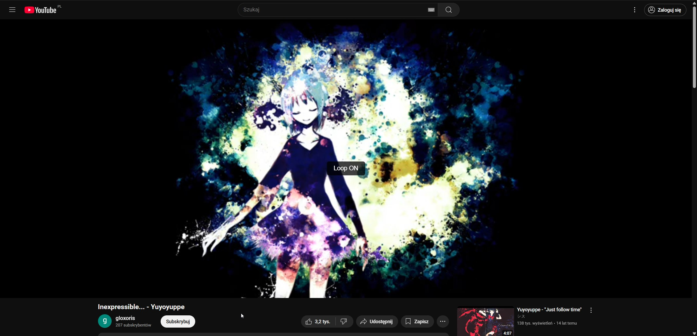

# YouTube Auto Loop + Next Video — Userscript (No Enhancer Required)

## 📌 Description
A lightweight userscript that adds automatic looping and keyboard shortcuts to YouTube — **without requiring Enhancer for YouTube™**.

This script works with all major userscript managers:

### 🧩 Compatibility
- **Tampermonkey** (Chrome, Edge, Firefox, Opera, Brave, Vivaldi, Safari)  
  👉 https://www.tampermonkey.net/

- **Violentmonkey** (Chrome, Edge, Firefox, Opera, Brave, Vivaldi)  
  👉 https://violentmonkey.github.io/

- **Greasemonkey** (Firefox only)  
  👉 https://addons.mozilla.org/firefox/addon/greasemonkey/

- **FireMonkey** (Firefox only)  
  👉 https://addons.mozilla.org/firefox/addon/firemonkey/

Perfect for users who want looping and quick navigation without installing large browser extensions.

---

## ✨ Features
- 🔁 **Auto Loop**  
  Automatically enables looping when a new video loads.

- 🧠 **User Override Memory**  
  If you disable loop manually, the script remembers it and will NOT auto‑enable loop on the next videos.

- ⌨️ **Keyboard Shortcuts**  
  - **R** — toggle loop ON/OFF  
  - **N** — skip to the next video  

- ⚡ **SPA Support**  
  Works with YouTube’s no‑reload navigation (changing videos without refreshing the page).

- 🪶 **Lightweight & Fast**  
  No external dependencies, no Enhancer required.

---

## 🖼 Preview

---

## 📥 Installation
1. Install a userscript manager (recommended: **[Tampermonkey](https://www.tampermonkey.net/)**).
2. Click below to install the script directly:  
   👉 **[Install YouTube Auto Loop + Next Video](./youtube-auto-loop.user.js)**
3. Your userscript manager will open an installation window — click **Install**.
4. Done — the script will run automatically on YouTube.

---

## ⚙️ Usage
- Open any YouTube video — looping will be enabled automatically.
- Press **R** to toggle looping.
- Press **N** to skip to the next video.
- If you disable loop manually, the script will not auto‑enable it on future videos.

---

## 📜 License
This project is licensed under the [MIT License](./LICENSE).  
You are free to use, modify, and distribute it as long as the license notice is included.
